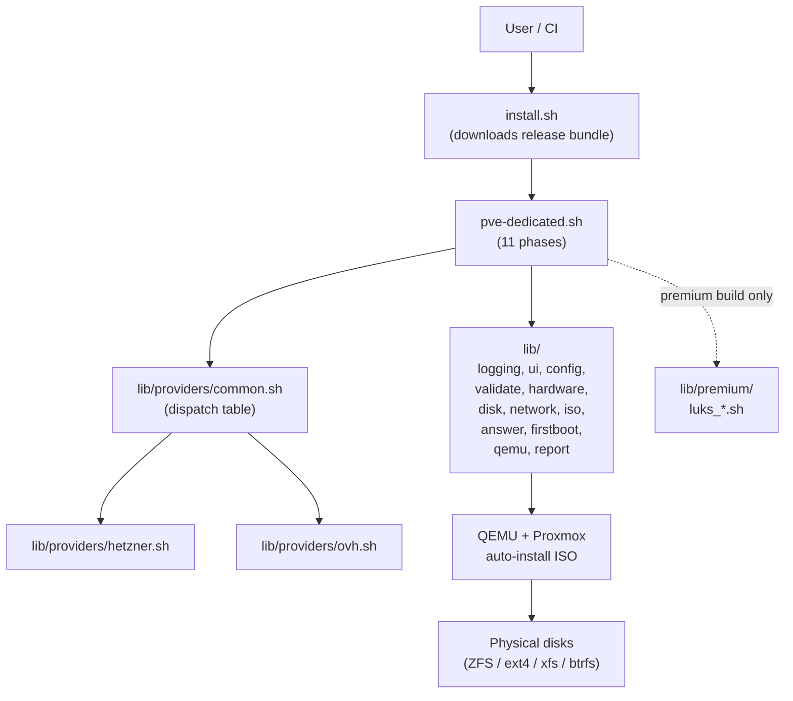

<!--
  This file is prepended to README.md by .github/workflows/sync-public.yml
  when the public mirror is regenerated. Edit it in the source repo only.
-->

# pve-dedicated (public mirror)

> **Repository status**
>
> This is the **PUBLIC mirror** of `corelix-io/pve-dedicated`. It is auto-generated
> from the source repository on every push to `main` and on every release tag.
> **Pull requests should be opened against the source repository, not this mirror.**
> Issues are accepted on either repository.
>
> Source of truth: <https://github.com/corelix-io/pve-dedicated> (private).

---

## Premium: host-level LUKS encryption

The public installer ships the full Hetzner and OVH provisioning pipeline, but
**host-level full-disk encryption is a premium feature** delivered as a signed
binary tarball to paying clients.

Premium adds:

- LUKS2 root encryption with a passphrase the operator controls
- `dropbear-initramfs` SSH unlock for remote reboot recovery
- TPM2-bound auto-unlock for trusted hardware (sealed against PCR state)
- Recovery tooling and a documented disaster-recovery runbook

Get premium access: <https://corelix.io/pve-dedicated-premium>

### FAQ

**Why isn't this in the public repo?**

Premium underwrites the maintenance of the free public installer. Host-level
encryption keying material, dropbear-initramfs hardening, and the TPM2 sealing
flow are sensitive enough that they ship as a signed artifact rather than
plaintext source. Shipping them out-of-band also lets us push security fixes
on a cadence independent from the public release schedule.

**How do clients receive it?**

After purchase, clients are added to the private source repository's release
feed and receive a signed tarball through private GitHub Releases. The premium
tarball unpacks an additional set of premium modules, templates, and a sample
LUKS configuration alongside the existing public install tree. No fork is
required and the public installer keeps working as-is.

**Can I get a trial?**

Yes. Request a time-limited evaluation key at the link above. Trials include
the full premium pipeline and can be exercised against a staging server before
purchase.

---

# pve-dedicated -- Proxmox VE Installer for Dedicated Servers

<div align="center">

**One Proxmox VE installer for Hetzner AND OVH dedicated servers.**

*Provided freely by [Corelix.io](https://corelix.io) - Made in France*

*Author: Amir Moradi*

[](LICENSE)


</div>

> **Heads up: `pve-hetzner` was renamed to `pve-dedicated` in 3.0.**
> The repo, the script entry point and the one-liner URL all changed. There are
> **no legacy aliases** -- your existing automation must update both the URL
> and the new mandatory `--provider` flag (or set `PVE_PROVIDER` in your
> config). See the dedicated migration guide:
> [docs/migration/renaming-to-pve-dedicated.md](docs/migration/renaming-to-pve-dedicated.md).

## Overview

`pve-dedicated` is an enterprise-grade automation tool for installing
**Proxmox VE** on **Hetzner** and **OVH** dedicated servers, directly from the
provider's rescue/recovery environment -- no KVM console, no IPMI, no manual
ISO juggling. It boots the official Proxmox auto-install ISO inside QEMU on the
rescue host, writes to your server's physical disks, and configures networking
the way each provider expects it.

OVH is a first-class provider in this release: NAT, routed (additional IPs)
and bridged modes are all supported, plus vRack as an optional second bridge.

### Key Features

- **Provider abstraction** -- a single codebase with per-provider modules in
  `lib/providers/` and a stable hook contract (rescue detection, DNS defaults,
  interface prediction, `/etc/network/interfaces` rendering, post-install
  notes).
- **One-liner install** with mandatory `--provider hetzner|ovh` selection
  (auto-detected when possible).
- **Hetzner**: NAT/routed/bridged, IP/MAC binding aware, `predict-check`
  integration, Robot firewall guidance.
- **OVH**: classic /24-style and Scale/HG/Advance `/32` + `100.64.0.1`
  gateway models, OVH-form IPv6 gateway derivation
  (`<prefix>:FF:FF:FF:FF:FF`), additional IPs (with vMAC reminders) and
  vRack on a second bridge (`vmbr2`).
- **IPv4-only networking** during install (rescue images of both providers
  have unreliable IPv6).
- **Dynamic hardware detection** -- auto-discovers disks, network interfaces,
  CPU, RAM, and boot mode (UEFI / legacy BIOS).
- **Interactive RAID selection** with usable capacity and redundancy
  per RAID level.
- **Full QEMU observability** -- serial console output and monitor socket;
  installer phases tracked in real time.
- **SSH hardening** -- auto-detects keys from rescue, disables password login
  (cluster-safe `PermitRootLogin prohibit-password`).
- **DHCP on NAT bridge** -- VMs get automatic connectivity via dnsmasq on
  `vmbr1` (`.100-.200`).
- **First-boot hooks** -- all configuration applied on first boot (PVE 8.3+).
- **Unattended mode** -- configure via CLI arguments or `.env` files.
- **ISO verification** -- SHA256 checksum validation.
- **Performance tuning** -- TCP BBR, swappiness, journald limits, pigz
  backups, ZFS ARC.
- **Enterprise logging** -- structured log levels, JSON reports.
- **Self-contained bundle** -- no runtime downloads of templates or scripts.

> **Premium**: Host-level **LUKS full-disk encryption**
> (passphrase + remote SSH unlock via dropbear-initramfs + TPM auto-unlock)
> is a separately licensed module. See the
> [Premium](#premium-features) section below.

### Compatible Servers

`pve-dedicated` is provider-aware, not model-specific. The matrix below
shows the ranges that have been validated end-to-end. Other models in the
same range generally work; please open an issue if a specific model needs
attention.

| Provider | Range | Examples | Tested | Notes |
|----------|-------|----------|--------|-------|
| Hetzner | [AX](https://www.hetzner.com/dedicated-rootserver/matrix-ax) | AX-52, AX-102, AX-162 | Yes | NVMe; UEFI by default |
| Hetzner | [EX](https://www.hetzner.com/dedicated-rootserver/matrix-ex) | EX-44, EX-101 | Yes | Mixed NVMe/SSD |
| Hetzner | [SX](https://www.hetzner.com/dedicated-rootserver/matrix-sx) | SX-64, SX-134 | Yes | Storage-heavy SATA |
| OVH | [Eco / Kimsufi / SoYouStart](https://eco.ovhcloud.com/) | KS-A, KS-LE, SYS series | Yes | Classic /24-style gateway, NAT mode default |
| OVH | [Rise](https://www.ovhcloud.com/en/bare-metal/rise/) | RISE-1, RISE-2, RISE-3 | Yes | Classic /24-style gateway |
| OVH | [Advance](https://www.ovhcloud.com/en/bare-metal/advance/) | ADV-1, ADV-2, ADV-3 | Yes | `/32` + `100.64.0.1` gateway -- pass `--ovh-gateway-model scale` |
| OVH | [Scale](https://www.ovhcloud.com/en/bare-metal/scale/) | SCALE-GPU, SCALE-* | Yes | `/32` + `100.64.0.1` gateway, vRack-ready |
| OVH | [High Grade](https://www.ovhcloud.com/en/bare-metal/high-grade/) | HGR-HCI, HGR-STOR | Yes | `/32` + `100.64.0.1` gateway, vRack-ready |

For provider specifics, see:

- [docs/providers/hetzner.md](docs/providers/hetzner.md)
- [docs/providers/ovh.md](docs/providers/ovh.md)

## Quick Start

### 1. Boot into Rescue Mode

| Provider | Steps |
|----------|-------|
| Hetzner | [Robot Panel](https://robot.hetzner.com) > Server > **Rescue** > Linux 64-bit > **Activate** > **Reset** > "Execute an automatic hardware reset" |
| OVH | [OVHcloud Manager](https://www.ovh.com/manager/) > Bare Metal Cloud > Server > **Netboot** > **Rescue** > save > Server > **Restart** |

After ~2 minutes, SSH in as `root` to the address shown in the rescue
notification email (OVH) or shown in the Robot panel (Hetzner).

### 2. Run the Installer

**One-liner (recommended)** -- the bootstrap script downloads the latest
release bundle and runs `pve-dedicated.sh`:

```bash
curl -4fsSL https://github.com/corelix-io/pve-dedicated/releases/latest/download/install.sh \
    | bash -s -- --provider hetzner
```

```bash
curl -4fsSL https://github.com/corelix-io/pve-dedicated/releases/latest/download/install.sh \
    | bash -s -- --provider ovh
```

**One-liner, fully unattended (Hetzner)**:

```bash
curl -4fsSL https://github.com/corelix-io/pve-dedicated/releases/latest/download/install.sh \
    | bash -s -- \
        --provider hetzner \
        --hostname pve1 --fqdn pve1.example.com --password 'YourSecurePassword' \
        --timezone UTC --email admin@example.com \
        --unattended --yes
```

**One-liner, fully unattended (OVH Scale / High Grade / Advance)**:

```bash
curl -4fsSL https://github.com/corelix-io/pve-dedicated/releases/latest/download/install.sh \
    | bash -s -- \
        --provider ovh --ovh-gateway-model scale \
        --hostname pve1 --fqdn pve1.example.com --password 'YourSecurePassword' \
        --timezone UTC --email admin@example.com \
        --unattended --yes
```

**Manual download**:

```bash
wget -4 https://github.com/corelix-io/pve-dedicated/releases/latest/download/install.sh -O install.sh
bash install.sh --provider hetzner
```

### 3. Switch Boot Source and Reboot

| Provider | What to do |
|----------|------------|
| Hetzner | Robot Panel > Server > **Reset** > "Execute an automatic hardware reset". A plain `reboot` from the rescue shell may loop back into rescue. |
| OVH | OVHcloud Manager > Server > **Netboot** > **Boot from the hard disk** > save, then reboot the server. The default after rescue is to keep booting rescue. |

### 4. Access Proxmox

After reboot:

- **Web UI**: `https://YOUR-SERVER-IP:8006`
- **SSH**: `ssh root@YOUR-SERVER-IP`
- **Login**: `root` with the password you set during installation

## Architecture

`pve-dedicated` is a thin orchestrator on top of provider-specific modules
that implement a common contract. The orchestrator is generic; everything
provider-aware lives in `lib/providers/<name>.sh`.



### Repository Layout

```
pve-dedicated.sh                 Orchestrator entry point (11 phases)
install.sh                       Bootstrap one-liner (downloads release bundle)
lib/
├── logging.sh                   Structured logging with levels
├── ui.sh                        Colors, spinners, progress bars, ui_read
├── config.sh                    CLI parsing, .env loading, defaults
├── validate.sh                  Input validation
├── cleanup.sh                   Trap handlers, process cleanup
├── hardware.sh                  CPU, RAM, boot mode detection
├── disk.sh                      Disk discovery, RAID selection, validation
├── network.sh                   Interface detection, IP / MAC extraction
├── iso.sh                       ISO download and verification
├── answer.sh                    answer.toml generation
├── firstboot.sh                 First-boot script generation
├── qemu.sh                      QEMU with serial console + monitor
├── ssh-config.sh                Legacy SSH-based config (fallback)
├── report.sh                    Installation report generation
├── providers/
│   ├── common.sh                Provider dispatch and registry
│   ├── hetzner.sh               Hetzner provider hooks
│   └── ovh.sh                   OVH provider hooks
└── premium/                     PREMIUM ONLY (private repo)
    └── luks_*.sh                LUKS host encryption module
templates/                       Configuration templates
configs/                         Example .env configuration files
docs/                            User-facing documentation
.github/workflows/               Release bundle CI (and strip pipeline)
```

### Installation Phases

| Phase | Description | Module |
|-------|-------------|--------|
| 1 | Preflight (root, provider rescue, KVM, premium gate) | `hardware.sh`, `providers/*` |
| 2 | Hardware detection (CPU, RAM, boot mode) | `hardware.sh` |
| 3 | Disk detection, selection, RAID level choice | `disk.sh` |
| 4 | Network interface detection (provider hook may refine) | `network.sh`, `providers/*` |
| 5 | Configuration (interactive or unattended) | `config.sh` |
| 6 | Input validation, summary, confirmation | `validate.sh`, `answer.sh` |
| 7 | Dependency installation | `iso.sh` |
| 8 | ISO download with SHA256 verification | `iso.sh` |
| 9 | Generate `answer.toml` + first-boot script (provider-rendered `/etc/network/interfaces`) | `answer.sh`, `firstboot.sh`, `providers/*` |
| 10 | QEMU installation with progress monitoring | `qemu.sh` |
| 11 | Installation report and reboot prompt | `report.sh` |

For the full architectural reference -- module dependency graph, provider
hook contracts, premium gate -- see [.claude/docs/ARCHITECTURE.md](.claude/docs/ARCHITECTURE.md).

## Configuration Reference

### CLI Options

```
PROVIDER:
  --provider NAME         Provider: hetzner | ovh (auto-detected if omitted)

SYSTEM:
  --hostname NAME         Hostname (e.g., pve1)
  --fqdn FQDN             Fully qualified domain name
  --password PASS         Root password
  --email EMAIL           Admin notification email
  --timezone TZ           Timezone (e.g., UTC, Europe/Berlin)
  --keyboard LAYOUT       Keyboard layout (default: en-us)
  --country CODE          Country code (default: us)
  --ssh-keys "KEY..."     SSH public keys (enables key-only SSH)

DISK:
  --disk-mode MODE        auto or manual (default: auto)
  --disks LIST            Comma-separated disk names (e.g., nvme0n1,nvme1n1)
  --filesystem FS         zfs, ext4, xfs, btrfs (default: zfs)
  --zfs-raid LEVEL        raid0, raid1, raid10, raidz-1/2/3 (default: raid1)
  --zfs-compress ALG      lz4, zstd, on, off (default: lz4)
  --zfs-ashift N          ZFS ashift value
  --zfs-arc-max MiB       ZFS ARC max memory in MiB

NETWORK:
  --interface NAME        Network interface override
  --private-subnet CIDR   NAT subnet (e.g., 192.168.26.0/24)
  --network-mode MODE     nat, routed, bridged (default: nat)
  --dhcp                  Enable DHCP server on NAT bridge (default)
  --no-dhcp               Disable DHCP server on NAT bridge
  --dns SERVERS           DNS servers (space-separated)

OVH-SPECIFIC:
  --ovh-gateway-model M   auto | classic | scale
                          Use 'scale' for High Grade / Scale / Advance
                          (/32 host IP with on-link 100.64.0.1 gateway)
  --ovh-vrack-interface I Second NIC name for vRack bridge (vmbr2)
  --ovh-vrack-ip CIDR     Static IP/CIDR on vRack bridge (vmbr2)
  --ovh-additional-ips L  Comma/space-separated /32s to route on vmbr0
                          (used in routed network mode)

PREMIUM (LUKS host encryption -- requires premium build):
  --enable-luks           Request host-level LUKS full-disk encryption
  --luks-passphrase P     Passphrase (or read interactively)
  --luks-unlock-modes L   Comma-separated: passphrase,ssh,tpm
                          (default: passphrase)
  --luks-dropbear-port N  Pre-boot SSH port for cryptroot-unlock
                          (default: 2222)
  --luks-wan-mac MAC      Pin pre-boot NIC by MAC (resilient across rename)

INSTALL:
  --iso PATH              Skip download, use local ISO
  --boot-mode MODE        auto, uefi, legacy (default: auto)
  --debian-suite SUITE    Debian suite (default: trixie)
  --config FILE           Load .env configuration file
  --unattended            No interactive prompts
  --yes, -y               Skip confirmation prompts
  --debug                 Enable debug logging
  --quiet                 Suppress info-level output
  --help, -h              Show help
  --version, -v           Show version
```

The OVH-specific flags are documented in detail in
[docs/providers/ovh.md](docs/providers/ovh.md). The premium LUKS flags are
documented in [docs/premium/luks.md](docs/premium/luks.md) (premium-only).

### Configuration File

Create a `.env` file (see `configs/` for examples):

```bash
# Provider selection (mandatory in unattended mode)
PVE_PROVIDER="hetzner"   # or "ovh"

# System
PVE_HOSTNAME="pve1"
PVE_FQDN="pve1.example.com"
PVE_ROOT_PASSWORD="secure-password"
PVE_TIMEZONE="UTC"
PVE_EMAIL="admin@example.com"
PVE_KEYBOARD="en-us"
PVE_COUNTRY="us"
PVE_SSH_KEYS="ssh-ed25519 AAAA... user@host"

# Disk
PVE_FILESYSTEM="zfs"
PVE_ZFS_RAID="raid1"
PVE_ZFS_COMPRESS="lz4"

# Network
PVE_PRIVATE_SUBNET="192.168.26.0/24"
PVE_NETWORK_MODE="nat"
PVE_ENABLE_DHCP=true
PVE_DNS_SERVERS="1.1.1.1 9.9.9.9"

# OVH-only (ignored on Hetzner)
PVE_OVH_GATEWAY_MODEL="auto"           # auto | classic | scale
PVE_OVH_VRACK_INTERFACE=""             # e.g. eno2
PVE_OVH_VRACK_IP_CIDR=""               # e.g. 10.42.0.10/24
PVE_OVH_ADDITIONAL_IPS=""              # e.g. "203.0.113.10,203.0.113.11"
```

### Precedence

Configuration values are merged in this order (last wins):

1. Built-in defaults (`configs/default.env`)
2. Config file (`--config`)
3. CLI arguments (re-applied after the config file is loaded)
4. Provider DNS defaults (only if `PVE_DNS_SERVERS` was left at the
   built-in default)
5. Interactive prompts (only when not in `--unattended`)

## What Gets Configured

The first-boot script applies these configurations automatically. The
**network rendering is provider-specific** -- the same generic phases
produce a Hetzner-correct or OVH-correct `/etc/network/interfaces`
depending on `PVE_PROVIDER`.

### Networking (NAT, default)

- `vmbr0` -- public bridge with the server's main IPv4 (and IPv6 when
  available) bridged to the physical NIC.
- `vmbr1` -- private NAT bridge for VMs/containers, with `MASQUERADE`.
- DHCP -- `dnsmasq` on `vmbr1` (`.100-.200` range), so VMs get IPs
  automatically.
- Provider-specific gateway handling: Hetzner uses the in-subnet
  gateway with `pointopoint`; OVH uses the in-subnet gateway for classic
  ranges or `100.64.0.1` for Scale/HG/Advance ranges.
- IPv6: Hetzner uses `fe80::1`; OVH derives the gateway from the prefix
  in the `<prefix>:FF:FF:FF:FF:FF` form (see
  [docs/providers/ovh.md](docs/providers/ovh.md)).

### SSH Security

When SSH keys are provided (auto-detected from rescue or manually entered):

- Keys installed to `/root/.ssh/authorized_keys` and
  `/etc/pve/priv/authorized_keys` (cluster-synced).
- `PermitRootLogin prohibit-password` (safe for Proxmox clustering).
- `PasswordAuthentication no`.
- Drop-in config at `/etc/ssh/sshd_config.d/99-hardening.conf`.

### Performance Tuning

- **TCP BBR** congestion control (better throughput on fast links).
- **TCP Fast Open** (reduced connection latency).
- **Swappiness = 10** (prevents aggressive swapping on hypervisors).
- **Kernel panic auto-reboot** after 10s (critical for unattended servers).
- **inotify watches** increased to 1M (fixes "no space left" with many
  containers).
- **Journald** limited to 64MB (prevents log bloat).
- **ZFS ARC** tuned dynamically based on RAM (5% min, 15% max).
- **nf_conntrack** tuned for NAT (1M max entries, 8h timeout).
- **pigz** installed for 2-4x faster vzdump backups.
- **vzdump** bandwidth limit removed, IO priority set.

### APT Repositories

- All enterprise repos disabled (PVE + Ceph, both `.list` and `.sources`
  formats).
- No-subscription repos added for PVE and Ceph.
- Subscription nag removed with daily cron to persist across updates.

## QEMU Observability

- **Serial console**: installer output captured to
  `logs/qemu-install-serial.log`.
- **Progress tracking**: real-time phase detection from serial output.
- **Monitor socket**: programmatic QEMU control via `socat`.
- **Timeout protection**: auto-kills after 20 minutes.
- **Failure diagnostics**: last 20 lines of serial output shown on error.

## Post-Installation Security

After reboot, **configure IP filtering before going to production**.

### Hetzner

1. `robot.hetzner.com` > Server > **Firewall**.
2. Create rules to ALLOW ports 22, 8006 only from your management IP(s).
3. Set default incoming policy to DROP.
4. Apply the firewall to your server.

### OVH

1. OVHcloud Manager > Bare Metal Cloud > **IP** > **Network firewall**
   on the relevant IP.
2. Activate the firewall, then create ALLOW rules for 22 and 8006 from
   your management IP(s) and a default DROP rule.
3. (Optional) Enable **Anti-DDoS Game** profile if your workload tolerates
   the latency profile.

In addition, enable the Proxmox built-in firewall at the Datacenter and
Node levels for defense in depth.

## Premium Features

`pve-dedicated` is open source. Some advanced features are shipped only
in the **premium** build (private repository) for sustainability of the
project.

### LUKS host encryption (premium)

Full-disk encryption of the Proxmox host with three unlock options:

- **Passphrase at console** -- the simplest option.
- **Pre-boot SSH unlock** via dropbear-initramfs -- SSH into the
  pre-boot environment from anywhere and run `cryptroot-unlock`.
- **TPM auto-unlock** -- hands-free reboots when the TPM measurements
  match the policy you sealed against.

The premium module also wires in:

- A MAC-pinned initramfs network hook (resilient across NIC name
  changes between rescue and the installed system).
- Recovery helpers (`tool.mount_os_in_rescue.sh`-style flows) for both
  Hetzner and OVH rescue.
- Provider-specific glue for both Hetzner Robot rescue and OVH netboot
  rescue.

```text
+-------------------------------------------------------------+
|  PREMIUM: LUKS host encryption                              |
|  + Passphrase + Remote SSH unlock + TPM auto-unlock         |
|  + Recovery helpers + Provider-specific glue                |
|                                                             |
|  Get premium access:                                        |
|    https://corelix.io/pve-dedicated-premium                 |
+-------------------------------------------------------------+
```

In the public build, passing `--enable-luks` triggers a clear premium
notice with the upgrade URL and continues the install without LUKS
(unless you cancel). Full operational documentation for the premium
module lives at [docs/premium/luks.md](docs/premium/luks.md) (premium
build only).

## Troubleshooting

See [.claude/docs/TROUBLESHOOTING.md](.claude/docs/TROUBLESHOOTING.md)
for common issues, organized by what is shared across providers vs.
what differs:

- Server unreachable after reboot (Hetzner vs OVH boot toggles)
- Locked out after SSH hardening
- QEMU fails to start or hangs
- ZFS pool not created
- Wrong boot mode
- Provider firewall not blocking traffic
- OVH gateway model mis-classified (`/32` ranges)

## Documentation

- [Changelog](docs/CHANGELOG.md)
- [Contributing](docs/CONTRIBUTING.md)
- [Migration: pve-hetzner -> pve-dedicated](docs/migration/renaming-to-pve-dedicated.md)
- Provider guides:
  - [Hetzner](docs/providers/hetzner.md)
  - [OVH](docs/providers/ovh.md)
- Premium:
  - [LUKS host encryption](docs/premium/luks.md) *(premium build only)*
- Internal references:
  - [Architecture](.claude/docs/ARCHITECTURE.md)
  - [Proxmox Auto-Install Reference](.claude/docs/PROXMOX-AUTOINSTALL.md)
  - [Troubleshooting](.claude/docs/TROUBLESHOOTING.md)

## License

[BSD 3-Clause with Branding Protection](LICENSE)

Copyright (c) 2025-2026, Amir Moradi / Corelix.io. Free to use, including
commercially. Derivative works must retain the original attribution and
may not reuse the project name or branding.

---

<div align="center">
<i>Provided freely by <a href="https://corelix.io">Corelix.io</a> - Made in France</i>
</div>
